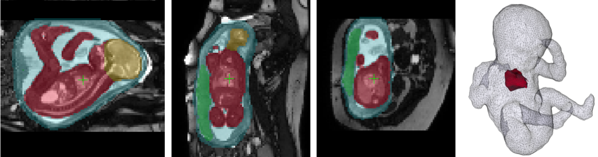

# Localisation and segmentation for fetal MRI 

3D-Unet based solutions for localisation and segmentation in fetal MRI stacks or motion-corrected volumes. 

## Contacts

In case of any questions regarding the code - please report an issue or contact Irina Grigorescu. 

## Quick how-to: setup

	conda env create -f environment.yml
	conda env list
	conda activate Segmentation_FetalMRI

## Quick how-to: running train_3D_Localisation.py

1. Prepare datasets for 3D localisation/segmentation - resampled (and padded) stacks and binary label masks:

	i_size=128   
	mkdir res_datasets/${case_id}   
	mirtk pad-3d org_datasets/${case_id}/stack.nii.gz res_datasets/${case_id}/stack.nii.gz ${i_size} 1   
	mirtk pad-3d org_datasets/${case_id}/mask-1.nii.gz res_datasets/${case_id}/mask-1.nii.gz ${i_size} 0   
	mirtk pad-3d org_datasets/${case_id}/mask-2.nii.gz res_datasets/${case_id}/mask-2.nii.gz ${i_size} 0   
	...

2. Prepare .csv files for training, validation, testing and running (see the example files):

    t2w                                       lab1                                       lab2   
    res-datasets/100027/stack.nii.gz    res-datasets/100027/mask-1.nii.gz    res-datasets/100027/mask-2.nii.gz   
    res-datasets/100034/stack.nii.gz    res-datasets/100034/mask-1.nii.gz    res-datasets/100034/mask-2.nii.gz   
    ...   

3. Modify train_3D_Segmentation.py:

    - root_dir=<your_own_path>
    - csv_dir=<your_own_path>
    - train_csv='data_localisation_2labels_train.csv'  # example
    - valid_csv='data_localisation_2labels_valid.csv'  # example
    - test_csv='data_localisation_2labels_test.csv'    # example
    -  run_csv='data_localisation_2labels_run.csv'    # example
    - results_dir=<your_own_path>
    - checkpoint_dir=<your_own_path>
    - I_size=<image_size>
    - N_classes=<number_of_labels+1(bg_label)>
    - ...

## License

The SVRTK Fetal MRI Segmentation package is distributed under the terms of the
[Apache License Version 2](http://www.apache.org/licenses/LICENSE-2.0). The license enables usage of SVRTK in both commercial and non-commercial applications, without restrictions on the licensing applied to the combined work.

## Citation and acknowledgements

In case you found SVRTK Fetal MRI Segmentation useful please give appropriate credit to the software by providing the corresponding link to our github repository.
